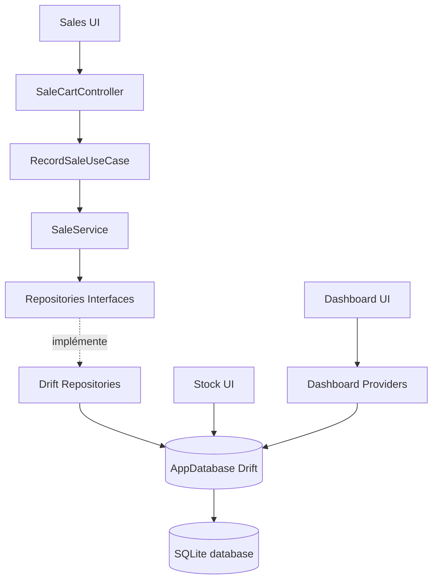
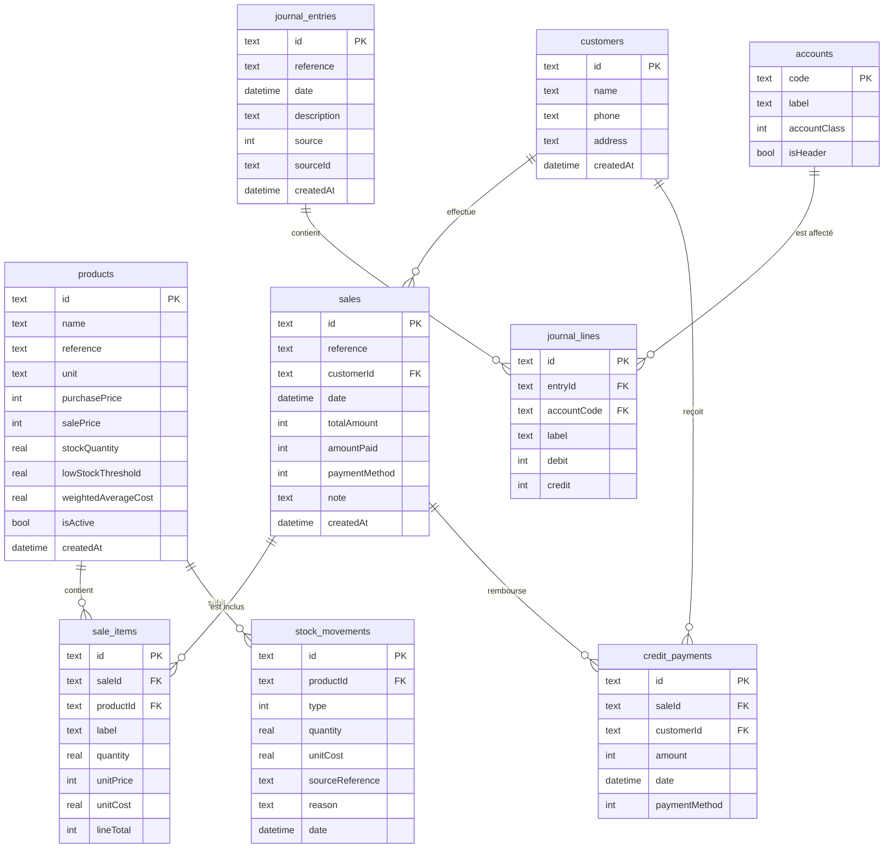

# Rapport d'Audit Global de GESCOMPTA

*Document d'architecture et de synthèse technique.*

Ce document synthétise les conclusions de l'audit architectural complet de
GESCOMPTA. Il répond de manière structurée aux 16 axes d'évaluation pour offrir
une visibilité totale sur le projet et permettre sa maintenance sur le long terme.

---

## 1. Structure du projet (arborescence)

L'application adopte une structure **Feature-First** sous `lib/` :

- `lib/core/` : socle technique transverse (`database`, `format`, `providers`,
  `router`, `theme`, `widgets`).
- `lib/features/` : modules métiers (`sales`, `stock`, `suppliers`, `dashboard`,
  `settings`, etc.).

### Anomalies détectées

- **Dossier vide** : `lib/features/accounting/presentation` est créé mais ne
  contient aucun fichier.
- **Placeholders** :
  - `lib/features/common/module_placeholder.dart` — écran temporaire des modules
    non codés.
  - `lib/features/receivables/presentation/clients_screen.dart` — coquille vide
    appelant le placeholder.

---

## 2. Architecture logicielle

Le projet présente une **dualité architecturale majeure** :

- **Module `sales`** : architecture en couches stricte (Clean Architecture) —
  UI (`sales_screen.dart`) → Application (`sale_cart_controller.dart`) → Domain
  (`RecordSaleUseCase`, entités, interfaces) → Data (`DriftProductRepository`,
  `DriftSaleRepository`…).
- **Autres modules** (`stock`, `suppliers`, `dashboard`, `settings`) :
  architecture plate (MVC simple). L'UI accède **directement** à SQLite (Drift)
  sans couche d'abstraction.



---

## 3. Flux de données

### 3.1 Flux propre (module `sales` — vente d'un article)

```
[Utilisateur clique sur Vendre]
     ↓
[SalesScreen] appelle SaleCartController.checkout()
     ↓
[SaleCartController] valide le panier et appelle RecordSaleUseCase.call()
     ↓
[RecordSaleUseCase] validations hors-base (quantité > 0) puis SaleService.record()
     ↓
[DriftSaleService] ouvre UNE transaction SQL : charge les CMP via ProductRepository,
    décrémente le stock via StockRepository, génère les écritures SYSCOHADA via
    AccountingRepository
     ↓
[Drift Repositories] → [Drift ORM] → [SQLite] écrit sur 'gescompta.sqlite'
     ↓
[Retour UI] succès → state mis à jour + dialogue de succès.
    Échec d'une étape → ROLLBACK automatique.
```

### 3.2 Flux direct (module `stock` — modification d'un produit)

```
[Utilisateur modifie un produit]
     ↓
[_ProductDialogState._save() (UI)]
     ↓
[AppDatabase (Drift)] appel direct : db.update(db.products)...write()
     ↓
[SQLite] écrit sur le disque
     ↓
[ProductsScreen] se reconstruit via productsStreamProvider
```

> **Critique :** ce flux direct contourne toute couche métier et couple l'UI à l'ORM Drift.

---

## 4. Base de données (schéma Drift/SQLite)

La base locale (`AppDatabase`) contient **9 tables** reliées avec intégrité
référentielle (`PRAGMA foreign_keys = ON`).



### Risques techniques identifiés

- **Absence de vérification de l'équilibre comptable au niveau SQL** : aucune
  contrainte/Trigger ne garantit `Σ débits = Σ crédits` pour une `journal_entry`.
  Cette responsabilité incombe à `sale_posting_policy.dart`. Un bug Dart peut
  déséquilibrer la base.
- **Valorisation CMP** : `weightedAverageCost` est géré en Dart lors d'une vente.
  Une modification manuelle du stock depuis l'écran Produit (sans service
  d'ajustement) fausse le CMP.

---

## 5. Riverpod (gestion d'état)

L'application déclare **15 providers**.

| Provider | Rôle | Dépendances | Consommation | Cycle de vie |
|----------|------|-------------|--------------|--------------|
| `databaseProvider` | Singleton d'accès Drift/SQLite | Aucune (surchargé dans `main`) | Tous les repos et streams | Global, permanent |
| `themeProvider` | Thème clair/sombre | Aucune | `AppHeader`, `app.dart` | Global, permanent |
| `productsStreamProvider` | Stream de la liste produits | `databaseProvider` | `ProductsScreen` | Global (déclaré dans l'UI) |
| `_accountsProvider` | Stream privé du plan comptable | `databaseProvider` | `AccountantExportScreen` | Privé au fichier UI |
| `dashboardDataProvider` | KPI Dashboard (en mémoire) | `databaseProvider` | `DashboardScreen` | Global, invalidation manuelle |
| `businessSummaryProvider` | Rapport financier simplifié | `databaseProvider` | `BusinessSummaryScreen` | Global, invalidation manuelle |
| `saleCartControllerProvider` | Panier d'achat courant | Repos, Use Cases | `SalesScreen` | Détruit après vente |

### Anomalies Riverpod

- **Dispersion des déclarations** : des providers transverses
  (`productsStreamProvider`, `_accountsProvider`) sont déclarés dans les fichiers
  UI, ce qui nuit à la réutilisation.
- **Invalidations impératives** : `ref.invalidate` manuels dans
  `SaleCartController` pour actualiser le Dashboard. Fragile : une transaction
  hors panier laisse le Dashboard périmé.

---

## 6. Analyse des services (SRP)

Seul service actif : `DriftSaleService`
(`lib/features/sales/data/services/drift_sale_service.dart`).

- **SRP : limite.** `record()` fait 5 tâches critiques dans une seule
  transaction (charger stocks, calculer CMP, créer la vente, modifier stocks,
  générer les lignes comptables). Concentration **justifiée** par l'atomicité
  ACID requise en base locale.
- **Absence de services** dédiés dans `stock`, `suppliers`, `settings`.

---

## 7. Analyse des repositories

- `sales` implémente proprement le pattern Repository.
- **Violations** : tous les autres modules n'ont pas de repository ; les widgets
  UI modifient directement Drift en instanciant des companions
  (`ProductsCompanion`).

---

## 8. Analyse des widgets (« Fat Widgets »)

Fichiers de présentation trop volumineux :

- `dashboard_screen.dart` (574 lignes)
- `suppliers_screen.dart` (478 lignes)
- `products_screen.dart` (468 lignes)
- `settings_screen.dart` (429 lignes)

Problèmes : fuite de la logique d'accès aux données (SQL Drift dans les
dialogues de formulaire), duplication UI (tables/pagination réécrites),
couplage fort UI ↔ Drift (tests unitaires impossibles sans Flutter + SQLite).

---

## 9. Navigation (GoRouter)

`lib/core/router/app_router.dart` est **sain**. `ShellRoute` intègre toutes les
pages dans `AppShell`. Routes : `/`, `/vendre`, `/produits`, `/clients`,
`/fournisseurs`, `/mon-commerce`, `/reglages`, `/reglages/espace-comptable`.
**Aucune route morte.**

---

## 10. Dépendances (`pubspec.yaml`)

**10 dépendances directes**, toutes justifiées pour une app de gestion locale
offline-first (Drift, riverpod, pdf, printing, go_router, uuid, intl). Aucun
package gadget.

---

## 11. Qualité du code

- **Code mort** : aucune classe/fichier totalement orphelin.
- **Imports inutilisés** : 5 imports obsolètes de `app_colors.dart` dans
  `core/widgets/` et `app_shell.dart` (passage au thème dynamique).
- **Syntaxe dépréciée** : `withOpacity` (→ `withValues`) et `surfaceVariant`
  (→ `surfaceContainerHighest`).

---

## 12. Sécurité

- **Base en clair (risque majeur)** : `gescompta.sqlite` n'est pas chiffré.
  Vol de l'ordinateur = données financières lisibles immédiatement.
- **Validations** : uniquement dans l'UI. Aucune contrainte SQL restrictive
  (ex. `CHECK(sale_price >= 0)`).

---

## 13. Performances

- **Risque d'OOM** : le Dashboard et « Mon commerce » chargent l'intégralité des
  tables `sales`, `saleItems`, `journalLines` en RAM pour calculer des agrégats.
- **Absence de pagination SQL** : le catalogue produits est chargé entièrement
  puis paginé en Dart.

---

## 14. Dette technique classée

- **P1 (Critique)** : dualité architecturale, calculs financiers en RAM, écrans
  de démonstration fictifs (`SuppliersScreen`, `SettingsScreen`).
- **P2 (Haute)** : base non chiffrée (SQLCipher manquant), dispersion des
  providers dans l'UI, invalidation impérative Riverpod.
- **P3 (Moyenne)** : syntaxes dépréciées, SnackBars de faux exports comptables.

---

## 15. Architecture cible proposée

Standardiser les modules (`stock`, `suppliers`, `receivables`) selon un motif
Clean Architecture allégé, déjà en place pour `sales` :

```
[UI Widget] ──> [Riverpod Provider / Controller] ──> [Use Case] ──> [Repository Interface]
                                                                            ▲
                                                                            │ (Implémente)
                                                                 [Drift Repository Impl]
                                                                            │
                                                                       [Drift DB]
```

---

## 16. Conclusion et plan de travail

GESCOMPTA dispose de fondations SQL/Drift solides, d'un design system fluide et
d'un code globalement propre. Pour une maintenance sereine sur plusieurs années,
il est crucial d'**harmoniser l'accès aux données** des différents modules et de
**migrer les calculs du tableau de bord vers des requêtes SQL agrégées** avant le
déploiement en production.
